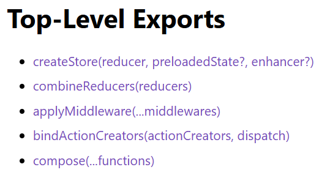

# Redux core Api

* In our previous readme file(contex api todo) we have seen a end-to-end working todo where i have used react useState,context api, userReducer, and things working fine till now.


* Now we will add more capability in this project but the useReducer that we see today this were not existing from initial day, berfore reducer there we a famous state management liberary called redux, apart from this there is other state management liberary called mobX Zustand, Recoil, Jotai, and the built-in React Context API.


* if you see any production level code then mostly you will find react with redux. it provides us, dispatching same action and prepare reducers and many other functionalities.

* In our current todo application we are using context api so that all components share a common store, we do this by wraping all components insied the app using provider see below code

```js
function App() {

  const [list, dispatch] = useReducer(todoReducer, [])

  return (
    
  <TodoContext.Provider value={{list}}>  // here list and value is accessible to Addtodo and TodoList both
  <TodoDispatchContext.Provider value={{dispatch}}> 
    <AddTodo/>
    <TodoList />
    </TodoDispatchContext.Provider>
    </TodoContext.Provider>
  )
}
```

## Understanding Redux

* Redux is a predictable state containers and it can be used with various js application it can be used with react, nextjs, vue js etc.

### 1. Redux toolkit 
* it's a end to end redux setup tool which easily setup redux.

### 2. React redux
* it's help to setup redux with react

### 3. Redux core
* redux is not bind to any liberary it can be used with other liberary or framework as well.

* So redux has some core set of liberary which you can use everywhere.

* there are severl packages available to setup the redux with different set of liberary and framework but the core of the redux is same across all packages.

* So if you understand the redux-core you can work with any lib or framework.

* On top of redux-core there is react-redux built so setup redux in react app and if you want to setup very quickly redux with react then redux-toolkit you can use.


* There are mainly 5 functions in our redux liberary


1. createStore
2. combineReducer
3. applymiddleware
4. bindactioncreators
5. compose


### compose

```js
import { compose } from "redux"
function removeSpaces(string){
    return string.split(" ").join("")
}

function repeatString(string){
    return string.repeat(3)
}

function convertUpperCase(string){
    return string.toUpperCase()
}
const input = "aaa bbb ccc ddd"

// const output = convertUpperCase(repeatString(removeSpaces(input)))
// console.log(output)

const composedOutput = compose(removeSpaces,repeatString,convertUpperCase)
console.log(composedOutput(input))
```

* Here when i call removeSpaces(input) with input it pass result to the repeatString it repeats string 3 times and then call convertUppercase to and it will convert all the letter to uppercase.

* this is like call math function f(g(h(x))), remember class 12th

* ```const output = convertUpperCase(repeatString(removeSpaces(input)))```

* In the above part we are doing it manually but compose do it out of the box. when i call ```removeSpaces``` it's result are populated into ```repeatString``` and similiarly it's result populated into ```convertUpperCase```.

